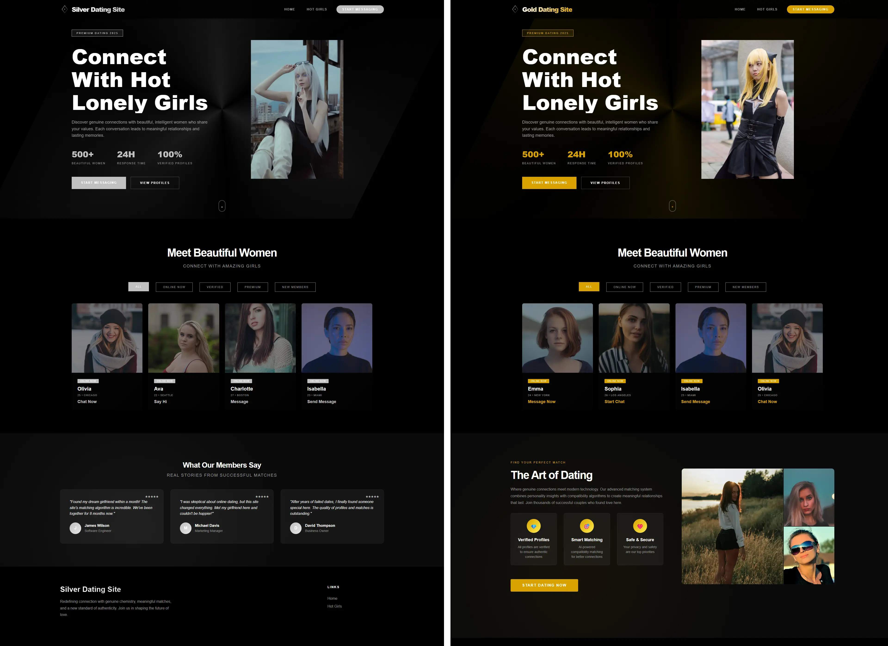

# Archfendus Turborepo

A monorepo for creating sites using Nuxt.js, Vue 3, and TypeScript. This skeleton allows developers to deploy multiple platforms with beautiful, responsive designs using the same code.



## 🏗️ What's Inside?

This Turborepo includes the following packages and applications:

### Apps

- **`gold`**: Premium gold-themed site with luxury UI
- **`silver`**: Elegant silver-themed site with sophisticated design

### Packages

- **`nuxt-base`**: Shared Nuxt.js base package with common functionality
- **`ui`**: Reusable Vue 3 component library for the site elements
- **`styles`**: Centralized SCSS styles with 7-1 architecture pattern
- **`shared-types`**: TypeScript type definitions shared across all apps
- **`eslint-config-custom`**: ESLint configurations for TypeScript and Vue
- **`tsconfig`**: TypeScript configurations used throughout the monorepo

## ✨ Features

- **🎨 Multiple Themes**: Gold and Silver color schemes with CSS custom properties
- **📱 Responsive Design**: Mobile-first approach with modern CSS Grid and Flexbox
- **⚡ Performance**: Optimized with Nuxt.js SSR, lazy loading, and modern build tools
- **🔧 TypeScript**: Full type safety across the entire monorepo
- **🎯 Component Library**: Reusable UI components for rapid development
- **📦 Monorepo**: Shared packages and efficient dependency management
- **🎨 SCSS Architecture**: Organized styles following 7-1 pattern and Sass Guidelines

## 📁 Project Structure

```
archfendus-turborepo/
├── apps/
│   ├── gold/                # Gold-themed site
│   └── silver/              # Silver-themed site
├── packages/
│   ├── nuxt-base/           # Shared Nuxt.js functionality
│   ├── ui/                  # Vue 3 component library
│   ├── styles/              # SCSS styles (7-1 pattern)
│   ├── shared-types/        # TypeScript definitions
└── turbo.json              # Turborepo configuration
```

## 🗺️ App Schema


## 🛠️ Tech Stack

- **Framework**: [Nuxt.js 3](https://nuxt.com/)
- **Frontend**: [Vue 3](https://vuejs.org/) with Composition API
- **Styling**: SCSS with 7-1 architecture
- **TypeScript**: Full type safety
- **Monorepo**: [Turborepo](https://turborepo.com/)
- **Deployment**: [Vercel](https://vercel.com/)

---

**Built with ❤️ using Turborepo, Nuxt.js, and Vue 3**
